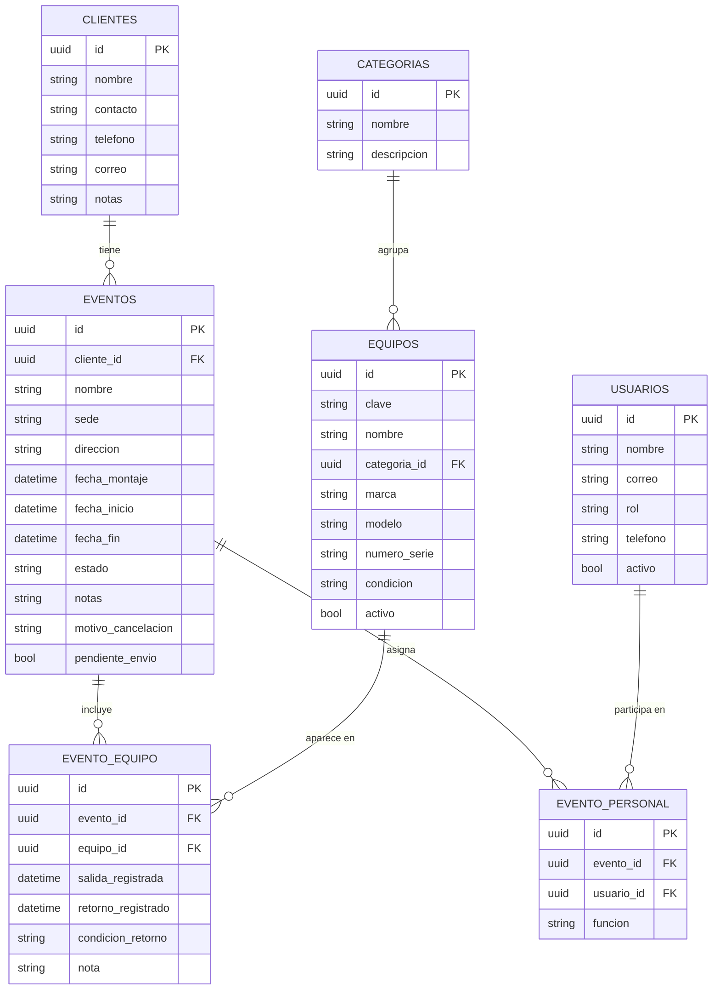

# Modelo entidad-relación — RIDER

Siete tablas, según la sección 4 del documento del proyecto. Los nombres son sugerencia del documento; la estructura no.

## Notas de diseño

- **`equipos.numero_serie`**: existe porque el equipo decidió manejar el inventario **por pieza**, no por cantidad (ver sección 10, pregunta 2 — documentada en `DECISIONES_SECCION10.md`).
- **`eventos.pendiente_envio`**: columna que sostiene el trabajo sin conexión del técnico. Nace marcada en el teléfono y se limpia cuando el servidor confirma la recepción.
- **`evento_equipo`** no es una tabla puente vacía: es la hoja de carga. Cada renglón sabe si esa pieza ya salió de bodega, si ya regresó y en qué condición — de ahí sale el dato de qué se rompió, en qué evento y quién lo tenía.
- **Relaciones muchos-a-muchos**: `evento_equipo` (un evento lleva muchos equipos, un equipo pasa por muchos eventos) y `evento_personal` (un evento lo monta una cuadrilla, un técnico trabaja en muchos eventos).
- La validación de traslape (módulo 2) consulta `evento_equipo` cruzando fechas de `eventos` para el mismo `equipo_id` — por eso módulo 2 y módulo 3 comparten esta tabla y deben ponerse de acuerdo en su estructura antes de programar por separado.
